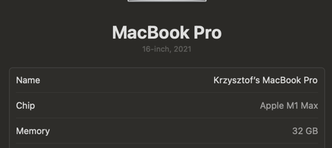

## Lab2

Source code for AES CTR implementation (usage) is located in src/lab2/lab2.ts in node-playground package.

```
Input file size: 10 Gigabytes
Encryption key saved to: /Users/krzysiekpriv/PycharmProjects/szyfrowanie/node-playground/src/assets/large-file.txt.encrypted.enc.key
Initialization vector saved to: /Users/krzysiekpriv/PycharmProjects/szyfrowanie/node-playground/src/assets/large-file.txt.encrypted.enc.iv
File encrypted successfully: /Users/krzysiekpriv/PycharmProjects/szyfrowanie/node-playground/src/assets/large-file.txt.encrypted.enc
Encryption Time: 7.579s
File decrypted successfully: /Users/krzysiekpriv/PycharmProjects/szyfrowanie/node-playground/src/assets/large-file.txt.decrypted.txt
Decryption Time: 7.620s
```

```
➜  assets git:(main) ✗ ls -lh
total 62914832
-rw-r--r--@ 1 krzysiekpriv  staff    10G Apr  1 20:20 large-file.txt
-rw-r--r--  1 krzysiekpriv  staff    10G Apr  1 20:34 large-file.txt.decrypted.txt
-rw-r--r--  1 krzysiekpriv  staff    10G Apr  1 20:34 large-file.txt.encrypted.enc
-rw-r--r--  1 krzysiekpriv  staff    16B Apr  1 20:34 large-file.txt.encrypted.enc.iv
-rw-r--r--  1 krzysiekpriv  staff    32B Apr  1 20:34 large-file.txt.encrypted.enc.key
```

Experiment ran on machine:


