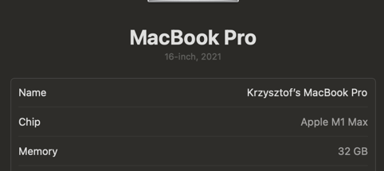

## 3DES in OFB mode

Lib docs:
https://pycryptodome.readthedocs.io/en/latest/src/cipher/des3.html
Example run logs:

```text
(.venv) ➜  szyfrowanie git:(main) ✗ python gen_file.py                                         
File large_data.json generated successfully!
(.venv) ➜  szyfrowanie git:(main) ✗ ls -lh large_data.json 
-rw-r--r--  1 krzysiekpriv  staff   2.1G Mar 20 17:43 large_data.json
(.venv) ➜  szyfrowanie git:(main) ✗ python app.py 
Encryption started...
Encryption of large_data.json took 91.6295 seconds.
Encryption complete. Encrypted data saved to encrypted_data.bin
Decryption started...
Decryption of encrypted_data.bin took 89.8344 seconds.
Decryption complete. Decrypted data saved to decrypted_data.json
b'\x04\xfem\xdf\xc8L)\xe3WR^\x80d\xe0\x91\xb9W \xfd\x0b\xf1\x10\x86\x94'
(.venv) ➜  szyfrowanie git:(main) ✗ python compare_files.py large_data.json decrypted_data.json 
The files are identical.

```

Machine: 

